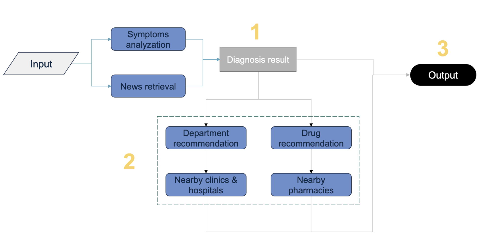

# AI Medical Assistant 🤖🏥
An intelligent medical assistant that helps users diagnose symptoms, recommend specialists, and locate nearby healthcare facilities.
## Overview
This project is powered by an AI agent with two key functionalities. First, it performs an initial diagnosis by analyzing not only the provided symptoms but also the patient’s medical history, family history, travel history, and recent epidemic reports from the news. Second, it helps locate nearby medical centers, clinics, and pharmacies based on the given address.
The diagram below provides an overview of the system's workflow, followed by detailed explanations of each AI agent.
{:height="200px" width="300px"}

